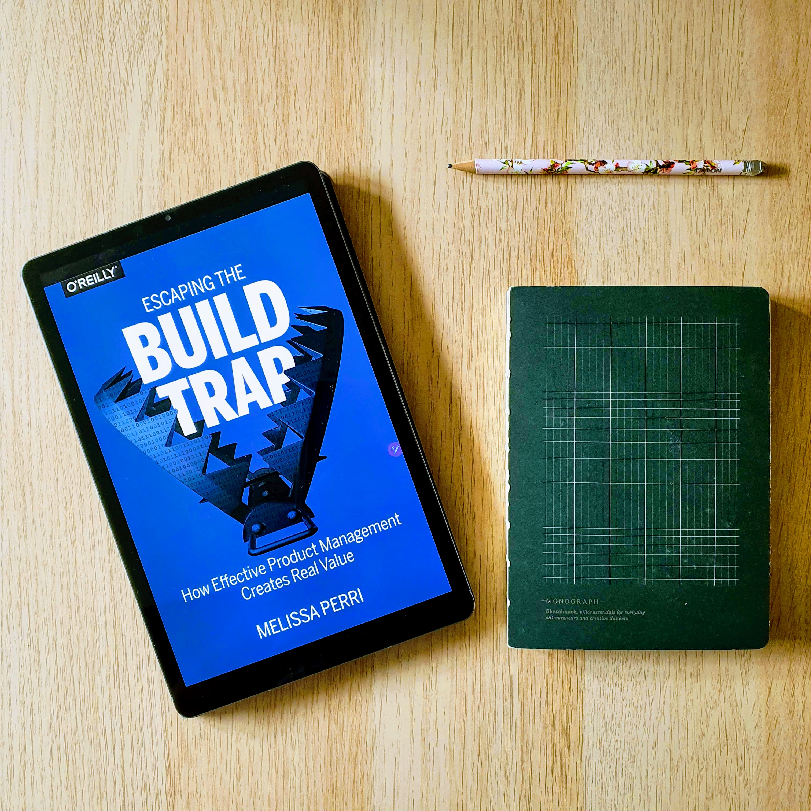
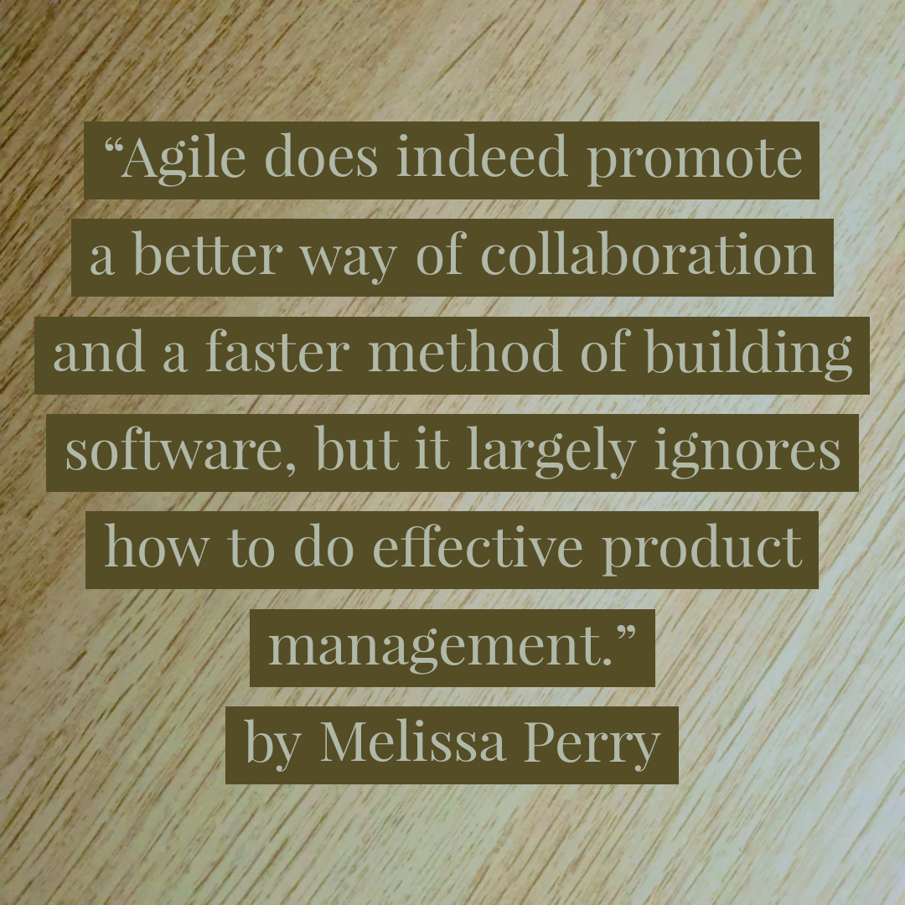

*Deutsche Version weiter unten*

Escaping the Build Trap by Melissa Perry is a wonderful book for all those who want to move towards product management and learn the interplay between the role of product manager, strategy and the analysis process. In addition, there is a chapter on how the organization itself often gets in the way of working product-oriented by living inappropriate processes for budgets and bonuses.

My favorite quote (swipe left) is already on page 43 and reflects for me the basic problem. Many companies want to become agile, but by that they mean the introduction of Scrum in the IT department and forget that the processes in business analysis must also change.

[Buy this book](https://www.amazon.com/-/de/Rising-Strong-Ability-Transforms-Parent/dp/081298580X/ref=sr_1_5?__mk_de_DE=%C3%85M%C3%85%C5%BD%C3%95%C3%91&dchild=1&keywords=brene+brown&qid=1591641857&sr=8-5) 

---

Escaping the Build Trap von Melissa Perry ist ein wunderbares Buch für alle, die sich in Richtung Product Management entwickeln wollen und das Zusammenspiel zwischen der Rolle Product Manager, Strategie und Analyseprozess lernen wollen. Zusätzlich gibt es ein Kapitel, in wiefern sich die Organisation selber häufig im Weg steht produkt-orientiert zu arbeiten, indem sie nicht passende Prozess für Budgets und Bonuse lebt.

Mein Lieblingszitat steht bereits auf Seite 43 und spiegelt für mich das Grundproblem. Viele Firmen wollen agil werden, meinen damit aber die Einführung von Scrum in der IT und vergessen darüber, dass sich auch die Prozesse in der Business Analyse ändern müssen.

[Dieses Buch kaufen](https://www.amazon.de/Raus-aus-Feature-Falle-effektives-Produktmanagement/dp/3960091206/ref=sr_1_2?__mk_de_DE=%C3%85M%C3%85%C5%BD%C3%95%C3%91&crid=2HI8FW6L8QW42&dchild=1&keywords=escaping+the+build+trap&qid=1599223180&sprefix=escaping+the%2Caps%2C159&sr=8-2)
